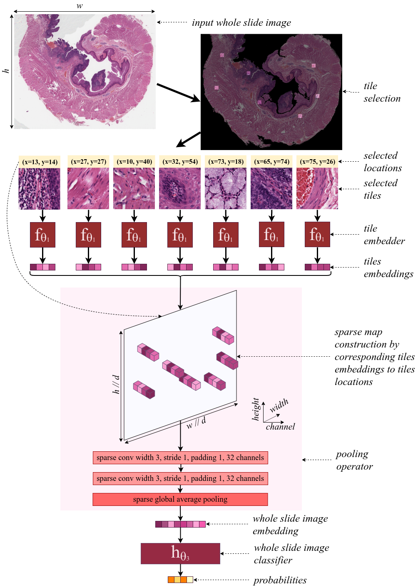

# SparseConvMIL
Library for ["Sparse Convolutional Context-Aware Multiple Instance Learning for Whole Slide Image 
Classification"](https://arxiv.org/abs/2105.02726) (COMPAY 2021).

This repository contains the full kit for training SparseConvMIL with any type of ResNet architecture as
tile embedder.
The provided data is from [The Cancer Genome Atlas](https://portal.gdc.cancer.gov/).

## Sparse Convolutional Multiple Instance Learning
SparseConvMIL is a powerful and generic multiple instance learning architecture specifically designed
to leverage spatial information in whole slide images.
This is done by building a sparse map that contains the embeddings of sampled tiles, which are
placed at the locations of the associated tiles within the source whole slide image.

This framework has shown state-of-the-art performance for subtype classification compared to 
conventional multiple instance learning approaches.

<p align="center">
    
</p>p>

## Hello world

To run the demo version:

`python -m training`

All models, including the tile embedder, the sparse-input pooling, the WSI embedding classifier and 
SparseConvMIL are located within the [model.py](model.py) file.
If you want to change one of several of these, check this file!

To accomodate for your data, either copy the architecture as displayed in the 
[sample_data](sample_data), or check the [dataset.py](dataset.py) file for expected data architecture 
or to change data loading.

## Setup

Clone this repo, create a virtual environment and download necessary packages:
```
git clone git@github.com:MarvinLer/SparseConvMIL
cd SparseConvMIL
virtualenv -p python3 venv; source venv/bin/activate
pip install -r requirements.txt
```

This library also relies on [SparseConvNet](https://github.com/facebookresearch/SparseConvNet):
```
# Get and install sparseconvnet
git clone git@github.com:facebookresearch/SparseConvNet.git
cd SparseConvNet/
bash develop.sh
```

## Citations
If you find this code useful in your research then please cite:

["Sparse Convolutional Context-Aware Multiple Instance Learning for Whole Slide Image 
Classification, COMPAY 2021"](https://arxiv.org/abs/2105.02726).

```
@article{lerousseau2021sparse,
  title={Sparse convolutional context-aware multiple instance learning for whole slide image classification},
  author={Lerousseau, Marvin and Vakalopoulou, Maria and Paragios, Nikos and Deutsch, Eric},
  journal={arXiv preprint arXiv:2105.02726},
  year={2021}
}
```

## License
SparseConvMIL is GNU AGPLv3 licensed, as found in the LICENSE file.
